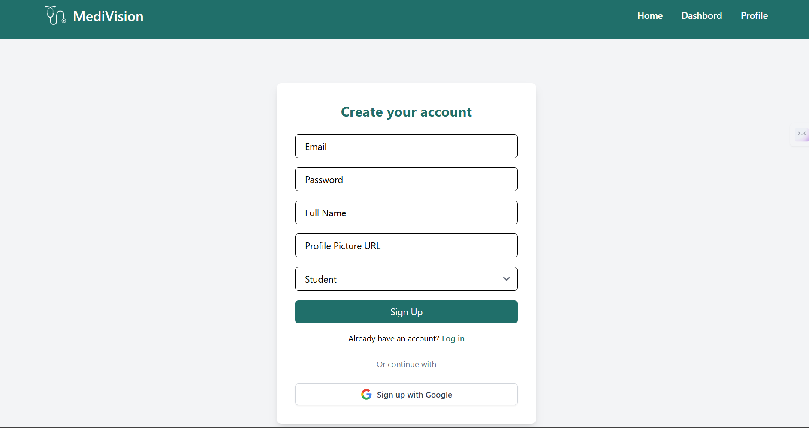
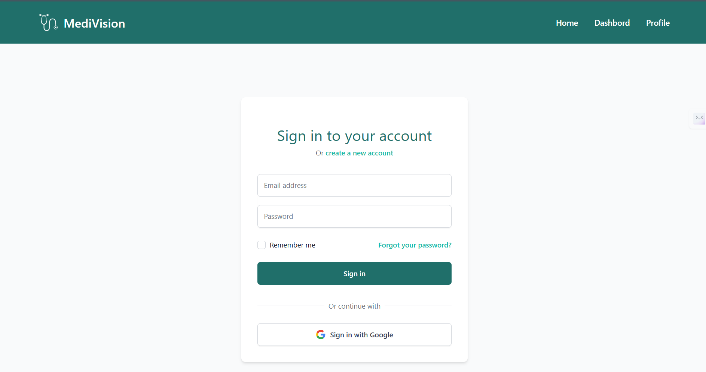
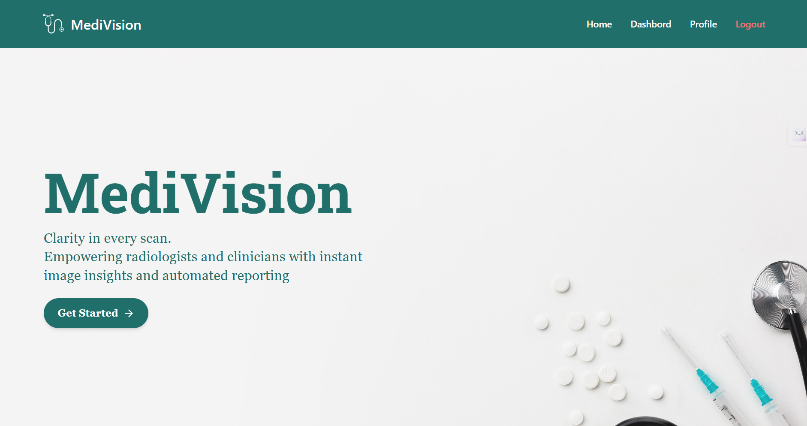
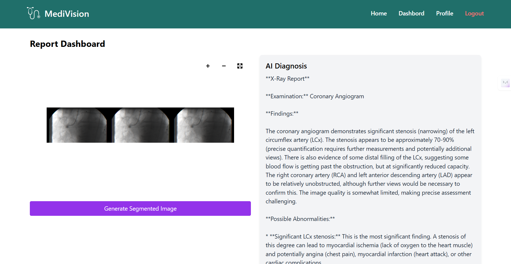
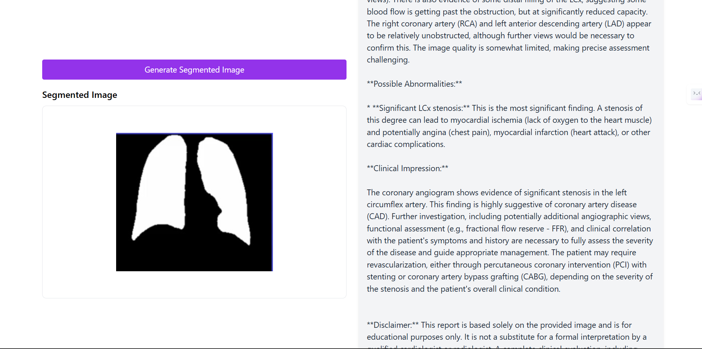
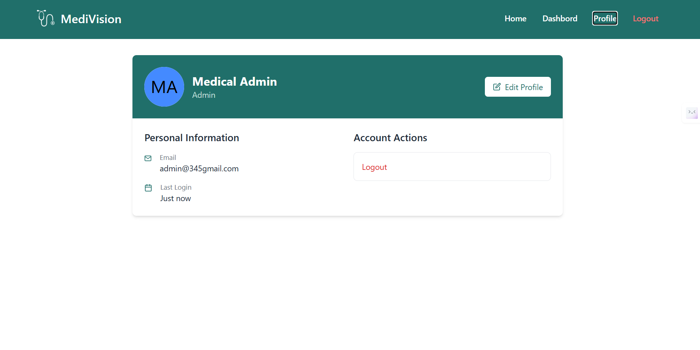
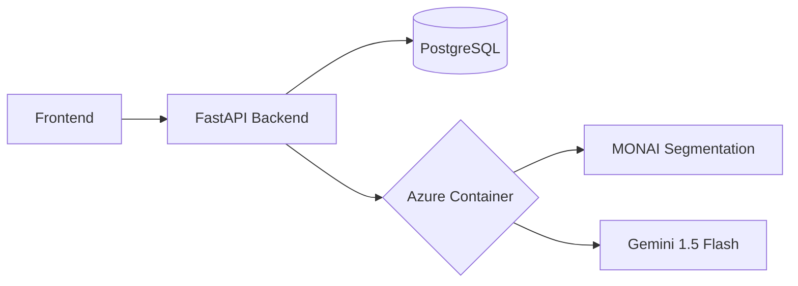

# Medical Imaging and Report Assistant

## 🌟 Project Overview
Clinical support tool that processes radiology images and patient data to generate draft reports using AI-powered segmentation, annotation, and diagnosis suggestions.


<div align="center">
  
  
  
  
</div>

## ✨ Features

### 🔐 Authentication
- **Multi-provider login**: 
  - Email/password authentication
  - Google OAuth integration
- **Role-based access control**:
  - **Instructors**: Full privileges (patient management, report editing)
  - **Students**: Scan analysis and viewing only

### 🏥 Patient Management
- Create/update patient records
- Medical history tracking
- Role-based access controls

### 🖼️ Medical Imaging
- **Supported formats**:
  - DICOM (.dcm)
  - NIfTI (.nii, .nii.gz)
  - Standard images (.png, .jpg)
- **AI-powered tools**:
  - Gemini 1.5 Flash Pro-Vision diagnostic suggestions
  - MONAI/NVIDIA segmentation (Azure-hosted)
- **Visualization**:
  - Multiplanar DICOM viewer
  - Window/level adjustment
  - Measurement tools

### 📝 Reporting
- AI-generated preliminary reports
- Instructor-editable findings

## 🛠️ Tech Stack
| Component          | Technology Used               |
|--------------------|-------------------------------|
| Frontend           | React + Vite                  |
| Backend            | FastAPI                       |
| Database           | PostgreSQL                    |
| Authentication     | JWT + OAuth (Google/GitHub)   |
| AI Vision          | MONAI (NVIDIA)                |
| Multimodal AI      | Gemini Flash 1.5 Pro Vision   |
| Cloud Deployment   | Microsoft Azure               |

## 🌐 API Endpoints

### 🔐 Authentication
| Endpoint                      | Method | Description                  |
|-------------------------------|--------|------------------------------|
| `/api/v1/auth/login/google`   | GET    | Google OAuth login           |
| `/api/v1/auth/login/email`    | POST   | Email/password login         |
| `/api/v1/auth/signup/email`   | POST   | Email registration           |

### 👤 Profile
| Endpoint                   | Method | Description                  |
|----------------------------|--------|------------------------------|
| `/api/v1/auth/me`          | GET    | Get user profile             |
| `/api/v1/auth/me`          | PUT    | Update profile               |
| `/api/v1/auth/last-login`  | GET    | Get last login timestamp     |

### 🏥 Patients
| Endpoint                   | Method | Description                  |
|----------------------------|--------|------------------------------|
| `/api/v1/patients/`        | GET    | List all patients            |
| `/api/v1/patients/`        | POST   | Create new patient           |
| `/api/v1/patients/search/` | GET    | Search patients              |

### 🖼️ Scans
| Endpoint                           | Method | Description                  |
|------------------------------------|--------|------------------------------|
| `/api/v1/scans/`                   | POST   | Upload new scan              |
| `/api/v1/scans/`                   | GET    | List all scans               |
| `/api/v1/scans/{scan_id}/image`    | GET    | Get scan image               |

### 📝 Reports
| Endpoint                                   | Method | Description                          |
|--------------------------------------------|--------|--------------------------------------|
| `/api/v1/reports/`                         | POST   | Create new report                    |
| `/api/v1/reports/{report_id}`              | GET    | Get report details                   |
| `/api/v1/reports/{report_id}`              | PUT    | Update report                        |
| `/api/v1/reports/segment_scan/{scan_id}`   | POST   | Segment scan (MONAI integration)     |
| `/api/v1/reports/analyze_scan/{scan_id}`   | POST   | AI analysis (Gemini integration)     |

## 🤖 AI Integration

### MONAI Segmentation Endpoint
```http
POST http://monai-seg-api-instance.eastus.azurecontainer.io:8000/segment
Content-Type: multipart/form-data

{
  "file": "binary_dicom_data",
  "model": "spleen_ct_segmentation"
}
```

### Gemini Vision Integration
```python
# Sample request to Gemini for analysis
response = generative_model.generate_content([
    "Analyze this medical scan and suggest findings",
    scan_image
])
```

## 🐳 Deployment Setup

### Backend
```bash
uvicorn app.main:app --reload
```

### Frontend
```bash
npm run dev
```

### MONAI on Azure
```bash
docker build -t monai-segmentation -f docker/Dockerfile.monai .
az container create --resource-group yourRG --name monai-seg-api-instance \
  --image yourRegistry.azurecr.io/monai-segmentation:latest \
  --ports 8000 --cpu 4 --memory 8
```

## 📂 Project Structure
```
ai_medical_imaging
├─ backend
│  ├─ app
│  │  ├─ api
│  │  │  ├─ utils
│  │  │  │  └─ image_converter.py
│  │  │  └─ v1
│  │  │     ├─ dependencies.py
│  │  │     ├─ endpoints
│  │  │     │  ├─ admin.py
│  │  │     │  ├─ auth
│  │  │     │  │  ├─ email.py
│  │  │     │  │  ├─ google.py
│  │  │     │  │  ├─ profile.py
│  │  │     │  │  └─ __init__.py
│  │  │     │  ├─ patients.py
│  │  │     │  ├─ reports.py
│  │  │     │  ├─ scans.py
│  │  │     │  ├─ segmentation.py
│  │  │     │  └─ users.py
│  │  │     ├─ routers.py
│  │  │     └─ __initi__.py
│  │  ├─ base.py
│  │  ├─ core
│  │  │  ├─ config.py
│  │  │  ├─ constants.py
│  │  │  └─ security.py
│  │  ├─ crud
│  │  │  └─ crud_report.py
│  │  ├─ database.py
│  │  ├─ db
│  │  │  ├─ base.py
│  │  │  ├─ init_db.py
│  │  │  ├─ models
│  │  │  │  ├─ patient.py
│  │  │  │  ├─ report.py
│  │  │  │  ├─ scan.py
│  │  │  │  └─ user.py
│  │  │  ├─ session.py
│  │  │  ├─ test.py
│  │  │  └─ __init__.py
│  │  ├─ db_test.py
│  │  ├─ main.py
│  │  ├─ schemas
│  │  │  ├─ patient.py
│  │  │  ├─ report.py
│  │  │  ├─ scan.py
│  │  │  ├─ token.py
│  │  │  ├─ user.py
│  │  │  └─ __init__.py
│  │  ├─ scripts
│  │  │  └─ create_admin.py
│  │  ├─ services
│  │  │  ├─ ai
│  │  │  │  ├─ ai_pipeline.py
│  │  │  │  ├─ gemini_reasoning.py
│  │  │  │  ├─ inference.py
│  │  │  │  ├─ models
│  │  │  │  │  ├─ segmentation.py
│  │  │  │  │  ├─ utils.py
│  │  │  │  │  └─ __init__.py
│  │  │  │  └─ segmentation.py
│  │  │  ├─ auth.py
│  │  │  ├─ oauth.py
│  │  │  ├─ patient.py
│  │  │  ├─ report_gen.py
│  │  │  ├─ scan.py
│  │  │  ├─ storage.py
│  │  │  └─ __init__.py
│  │  ├─ static
│  │  ├─ test.py
│  │  └─ __init__.py
│  ├─ medical_uploads
│  │  ├─ 1_e75d6763-9f51-497a-8383-ba3a6e146813.dcm
│  │  ├─ 3_c8ab5cdb-0ae8-4c9e-8c89-ee2c7976343e.dcm
│  │  ├─ 45a8d82a-886a-4b09-accd-bd66b189a495_10fcb5ca-92ae-4cf2-b73a-1fd0c15f705f.jpg
│  │  ├─ 45a8d82a-886a-4b09-accd-bd66b189a495_74c94747-d410-4d8f-80d1-22f1b291c6fb.dcm
│  │  ├─ 4_0136bced-b2ae-432f-995a-c238422e8b50.dcm
│  │  └─ f5c49a34-9997-45c9-a306-ac611c8127e3_b72aa3d6-ee22-4e75-8e0f-f14cd0efe436.jpg
│  ├─ requirements.txt
│  └─ static
│     └─ dcfedf0a-39ed-4e8d-8a4f-925ed8333a29.pdf
├─ frontend
│  ├─ eslint.config.js
│  ├─ index.html
│  ├─ package-lock.json
│  ├─ package.json
│  ├─ postcss.config.cjs
│  ├─ public
│  │  └─ vite.svg
│  ├─ README.md
│  ├─ src
│  │  ├─ api
│  │  │  └─ axios.js
│  │  ├─ App.css
│  │  ├─ App.jsx
│  │  ├─ assets
│  │  │  ├─ homepage
│  │  │  │  ├─ copy-space-stethoscope-medicine.jpg
│  │  │  │  ├─ image.jpg
│  │  │  │  └─ realistic-heart-medical-information.jpg
│  │  │  ├─ react.svg
│  │  │  └─ stethoscope.png
│  │  ├─ components
│  │  │  ├─ AnalyzeButton.jsx
│  │  │  ├─ Navbar.jsx
│  │  │  ├─ PatientDropdownWithSearch.jsx
│  │  │  ├─ PatientForm.jsx
│  │  │  ├─ PatientManager.jsx
│  │  │  ├─ ProtectedRoute.jsx
│  │  │  ├─ ReportViewer.jsx
│  │  │  ├─ ScanUploader.jsx
│  │  │  ├─ ScanViewer.jsx
│  │  │  └─ SegmentedScanViewer.jsx
│  │  ├─ contexts
│  │  │  └─ AuthContext.jsx
│  │  ├─ index.css
│  │  ├─ main.jsx
│  │  ├─ pages
│  │  │  ├─ Dashboard.jsx
│  │  │  ├─ Home.jsx
│  │  │  ├─ Login.jsx
│  │  │  ├─ OAuthCallback.jsx
│  │  │  ├─ ProfilePage.jsx
│  │  │  ├─ ReportDashboard.jsx
│  │  │  └─ Signup.jsx
│  │  └─ utils
│  │     └─ auth.js
│  ├─ tailwind.config.js
│  └─ vite.config.js
├─ medical_uploads
│  ├─ 45a8d82a-886a-4b09-accd-bd66b189a495_6dae7152-46a1-4604-a72b-125532c9037f.dcm
│  └─ f84ea455-4a3d-40a3-acb7-7d2bc937130b_2c45eb3d-9e83-41f0-aaa7-5a42abc92833.png
├─ monai_seg_api
│  ├─ app
│  │  ├─ main.py
│  │  └─ model.py
│  ├─ azure.deploy.sh
│  ├─ Dockerfile
│  ├─ model
│  │  └─ create_model.py
│  └─ requirements.txt
├─ README.md
└─ test_gemini.py

```

## 🖥️ Application Demo

### 🔒 Authentication Flow
**Signup Page**  
  
*Email/password or OAuth registration*

**Login Page**  
  
*JWT authentication with Google/GitHub OAuth*

### 🏠 User Dashboard
**Home Page**  
  
*Quick access to recent scans and reports*

**Patient Dashboard**  
  
*Overview of active cases and pending analyses*

### 📊 Medical Imaging Workflow
**Report Dashboard**  
  
  
*AI-generated reports with editable findings*

**Scan Analysis View**  
  
*Interactive DICOM viewer with segmentation overlay*

### ⚙️ Profile Management
**User Settings**  
  
*Update personal details and security preferences*

## ☁️ Cloud AI Integration
**Azure-Powered Segmentation**  
  
*Dockerized MONAI model deployed on Azure Container Instances*  
`Endpoint: http://monai-seg-api-instance.eastus.azurecontainer.io:8000/segment`

**Deployment Architecture**  

*Fig: System architecture with cloud AI components*
```
